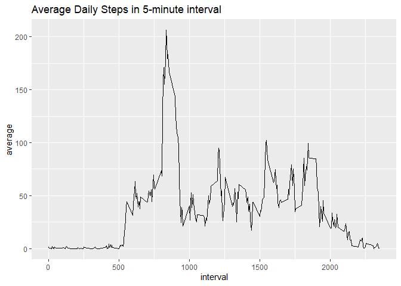
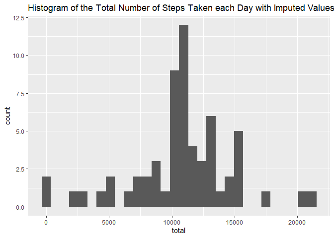
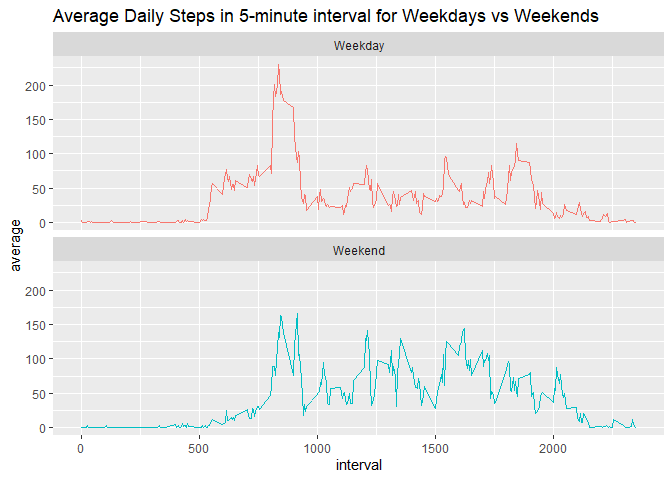

This assignment makes use of data from a personal activity monitoring device. This device collects data at 5 minute intervals through out the day. The data consists of two months of data from an anonymous individual collected during the months of October and November, 2012 (**date**) and include the number of steps taken (**steps**) in 5 minute intervals (**interval**) each day. This report aims to answer the below questions to derive insight into this data.  

## Loading and preprocessing the data
Load libraries.   

```r
library(lubridate)
library(tidyverse)
library(impute)
```

Unzip the "activity.zip" file saved in the working directory. Then read the CSV file of the same name and save it to the "activity" object. Convert the date column of the dataframe to a variable of class date.  


```r
unzip(".//activity.zip")
activity <- read.csv("activity.csv")
activity$date <- ymd(activity$date)

head(activity)
```

```
##   steps       date interval
## 1    NA 2012-10-01        0
## 2    NA 2012-10-01        5
## 3    NA 2012-10-01       10
## 4    NA 2012-10-01       15
## 5    NA 2012-10-01       20
## 6    NA 2012-10-01       25
```

## What is mean total number of steps taken per day?
Calculate the total steps per day, ignoring missing values in the dataset. Plot the frequency of these values in a histogram.  


```r
steps_per_day <- activity %>% group_by(date) %>% summarise(total = sum(steps, na.rm = TRUE))

ggplot(steps_per_day, aes(x = total)) + geom_histogram() + 
    ggtitle("Histogram of the Total Number of Steps Taken each Day")
```

```
## `stat_bin()` using `bins = 30`. Pick better value with `binwidth`.
```

<!-- -->

Report the mean and median of the total number of steps taken per day.

```r
steps_per_day %>% summarise(average = mean(total), median = median(total))
```

```
## # A tibble: 1 x 2
##   average median
##     <dbl>  <int>
## 1   9354.  10395
```

## What is the average daily activity pattern?
Calculate the average daily steps grouped by the interval and plot a time-series of the average daily number of steps taken broken into 5-minute intervals.  


```r
interval_pattern <- activity %>% group_by(interval) %>% summarise(average = mean(steps, na.rm = TRUE))

interval_pattern %>% ggplot(aes(interval, average)) + geom_line() + 
    ggtitle("Average Daily Steps in 5-minute interval")
```

<!-- -->

Report the time interval with the average maximum number of steps (peak daily activity).  

```r
interval_pattern$interval[which.max(interval_pattern$average)]
```

```
## [1] 835
```


## Imputing missing values
Report the total number of missing values in the dataset.  


```r
sum(is.na(activity))
```

```
## [1] 2304
```

Impute the missing values in steps by calculating the average daily steps in each interval and substituting in this value for the relevant intervals that are missing values on a particular date to create a new dataset.  


```r
new_act <- activity %>% group_by(interval) %>% mutate(interval_avg = mean(steps, na.rm = TRUE)) %>% ungroup()

for(i in 1:nrow(new_act)){
    if(is.na(new_act$steps[i])) {
        new_act$steps[i] <- new_act$interval_avg[i]
    } else {next}
}

head(new_act)
```

```
## # A tibble: 6 x 4
##    steps date       interval interval_avg
##    <dbl> <date>        <int>        <dbl>
## 1 1.72   2012-10-01        0       1.72  
## 2 0.340  2012-10-01        5       0.340 
## 3 0.132  2012-10-01       10       0.132 
## 4 0.151  2012-10-01       15       0.151 
## 5 0.0755 2012-10-01       20       0.0755
## 6 2.09   2012-10-01       25       2.09
```

Remake histogram of the the total number of steps taken each day.  


```r
new_steps_per_day <- new_act %>% group_by(date) %>% summarise(total = sum(steps))

ggplot(new_steps_per_day, aes(x = total)) + geom_histogram() + 
    ggtitle("Histogram of the Total Number of Steps Taken each Day with Imputed Values")
```

```
## `stat_bin()` using `bins = 30`. Pick better value with `binwidth`.
```

<!-- -->

Recalculate the mean and median of the total number of steps taken per day.  


```r
new_steps_per_day %>% summarise(average = mean(total), median = median(total))
```

```
## # A tibble: 1 x 2
##   average median
##     <dbl>  <dbl>
## 1  10766. 10766.
```

It seems that using this imputing method increases the mean and median of the data by reducing the number of days counted as having 0 steps.    

## Are there differences in activity patterns between weekdays and weekends?
Calculate the average daily steps grouped by the interval after defining the dates to be either a weekday or a weekend. Plot a time-series of the average daily number of steps taken for the two categories of date (weekday and weekend) broken into 5-minute intervals.  


```r
day_names_vector <- weekdays(new_act$date)

week_days <- c("Monday", "Tuesday", "Wednesday", "Thursday", "Friday")

days_class_factor <- ifelse(day_names_vector %in% week_days, "Weekday", "Weekend") %>% as.factor()

new_act %>% mutate(day = days_class_factor) %>% group_by(interval, day) %>% summarise(average = mean(steps)) %>%
    ggplot(aes(interval, average, colour = day)) + geom_line(show.legend = FALSE) +
    facet_wrap(~day, ncol=1, nrow = 2) +
    ggtitle("Average Daily Steps in 5-minute interval for Weekdays vs Weekends") 
```

<!-- -->
